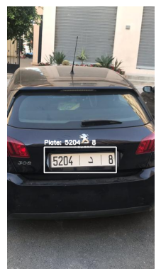

# Sistema de Reconocimiento y Detección de Placas de Automóviles
El reconocimiento óptico de caracteres, u OCR por sus siglas en inglés (Optical Character Recognition), consiste en la transcripción de texto identificado en imágenes. Esta tecnología puede usarse en una amplia gama de aplicaciones para automatizar diversas tareas, como lo son la recolección de información a partir de imágenes de facturas o documentos escaneados, la transcripción automática de texto o la identificación de señalamiento de anuncios viales.

En este repositorio se implementa un sistema de visión artificial para la detección automática de placas vehiculares y la identificación de caracteres mediante técnicas de OCR, orientado a automatizar procesos de control vehicular.

El proyecto se implementó en python, usando las siguientes librerías:
- OpenCV para el manejo y procesamiento de imágenes.
- Yolo-v4 para a la tarea de detección de las placas de automóviles.
- TeseractOCR para la extracción de texto de las placas detectadas.

El proyecto puede ejecutarse en el Notebook [implementation.ipynb](implementation.ipynb).

## Diseño del modelo
En primer lugar, se cargan los pesos y configuración del modelo preentrenado Yolo-v4. En este caso se usó la versión ALPR-with-Yolo-v4 implementada en el repositorio [anpr-with-yolo-v4](https://github.com/Dodant/anpr-with-yolo-v4), la cual está enfocada en la detección de vehículos y placas.


```python
import numpy as np
import cv2
import matplotlib.pyplot as plt
import pytesseract

# configuracion de pytesseract
pytesseract.pytesseract.tesseract_cmd = r'C:\Program Files\Tesseract-OCR\tesseract'

# configuracion del modelo
weights_path = 'yolo_v4/yolov4-obj.weights'
configuration_path = 'yolo_v4/yolov4-obj.cfg'
network = cv2.dnn.readNetFromDarknet(configuration_path, weights_path)

# nombres de las 3 capas de prediccion, cada una enfocada en la deteccion de objetos
# en escala: pequeno, mediano y grande
outputs = ['yolo_139', 'yolo_150', 'yolo_161']
```

Posteriormente se carga la imagen de entrada:


```python
# lectura de imagen
image_input = cv2.imread('imgs/car1.jpg')
h, w = image_input.shape[0:2] # dimensions de la imagen

# plot
plt.imshow(cv2.cvtColor(image_input, cv2.COLOR_BGR2RGB))
plt.axis('off')
plt.show()
```


    

    


A continuación se realiza el preprocesamiento necesario para la evaluación de la imagen de entrada en el modelo Yolo-v4:


```python
# Normalizacion, redimension 416, 416 e intercambio de canales Red y Blue
blob = cv2.dnn.blobFromImage(image_input, 1 / 255.0, (416, 416), swapRB=True, crop=False)
```


    

    


Se realiza la predicción del modelo sobre la imagen de entrada preprocesada. Como resultado, Yolo-v4 devuelve un conjunto de posibles objetos detectados en la imagen, su posición y la probabilidad de que la imagen pertenezca a la clase detectada. Cabe mencionar que el modelo devuelve 3 tipos de predicciones, pertenecientes a imágenes en escala pequeña, mediana y grande. Por lo cual se optó por utilizar únicamente la predicción con el mayor porcentaje de certeza de pertenecer a la clase `license_plate`.

Una vez que se ha identificado dicha predicción, se extrae el contenido de la región de interés para su análisis.


```python
# prediccion del modelo sobre la imagen
network.setInput(blob)
predictions = network.forward(outputs)

plates = []
for layer in predictions: # predicciones de cada capa
    aux = layer
    scores = aux[:,5] # probabilidades de la clase license plates
    scores = scores >= 0.5 # solo se consideran predicciones arriba de 50%
    aux = aux[scores]
    
    if len(aux>0):
        plates += list(aux)

# se elige el candidato mas optimo
plates = np.array(plates)
ind = np.argmax(plates[:,5])
plate_info = plates[ind]

# caja considerando las dimensiones 416,416
box = plate_info[0:4] * np.array([w, h, w, h])
x_center, y_center, box_width, box_height = box.astype('int')
x_min = int(x_center - (box_width / 2))
y_min = int(y_center - (box_height / 2))

# plot de la placa
img_plate = image_input[y_min:y_min+box_height, x_min:x_min+box_width]
plt.imshow(cv2.cvtColor(img_plate, cv2.COLOR_BGR2RGB))
plt.show()
```


    

    


Posteriormente, se realiza el siguiente preprocesamiento a la imagen obtenida:
- Transformación a escala de grises.
- Aplicación de filtro Gaussiano para suavizar la imagen.
- Binarización de píxeles para resaltar los detalles de los caracteres en la placa.


```python
gray = cv2.cvtColor(img_plate, cv2.COLOR_BGR2GRAY) # transformacion a escala de grises
gauss = cv2.GaussianBlur(gray, (5,5), 0) # aplicacion de filtro gaussiano
bin_img = cv2.threshold(gauss, 0, 255, cv2.THRESH_BINARY + cv2.THRESH_OTSU)[1] # binarizacion

# plot
fig, axs = plt.subplots(2,2)
labels = ['1. Original', '2. Grises', '3. Suavizado', '4.Binariacion']
imgs = [cv2.cvtColor(img_plate, cv2.COLOR_BGR2RGB), gray, gauss, bin_img]
for axi, im, li in zip(axs.flat, imgs, labels):
    if li=='1. Original':
        axi.imshow(im)
    else:
        axi.imshow(im, cmap='gray')
    axi.axis('off')
    axi.set_title(li)
plt.show()
```


    

    


Posteriormente, se usa la imagen binarizada para la extracción de caracteres con TesseractOCR:


```python
# identificacion de caracteres
text = pytesseract.image_to_string(bin_img, lang ='eng')
text = text.replace('\n', '') # elimina saltos de linea
text
```


    '5204 - 8'


Finalmente, se realiza el plot final, incluyendo la detección de la placa y el texto extraído


```python
# color de la bounding box y texto
color = [250, 250, 250]

# bounding box
cv2.rectangle(image_input, (x_min, y_min), (x_min + box_width, y_min + box_height), color, 2)

# Texto identificado
text_box_current = f'Plate: {text}'
cv2.putText(image_input, text_box_current, (x_min, y_min - 7), cv2.FONT_HERSHEY_SIMPLEX, 0.5, color, 2)

# plot
plt.imshow(cv2.cvtColor(image_input, cv2.COLOR_BGR2RGB))
plt.axis('off')
plt.show()
```


    

    


## Implementación final
Por último, se realiza una implementación final considerando todos los aspectos revisados en la sección anterior, y se incluyen ejemplos del uso de la clase implementada.


```python
# librerias necesarias
import numpy as np
import cv2
import matplotlib.pyplot as plt
import pytesseract

class DetectionModel:
    def __init__(self):
        # configuracion de pytesseract
        pytesseract.pytesseract.tesseract_cmd = r'C:\Program Files\Tesseract-OCR\tesseract'

        # configuracion del modelo
        weights_path = 'yolo_v4/yolov4-obj.weights'
        configuration_path = 'yolo_v4/yolov4-obj.cfg'
        self.network = cv2.dnn.readNetFromDarknet(configuration_path, weights_path)

        # nombres de las 3 capas de prediccion, cada una enfocada en la deteccion de objetos
        # en escala: pequeno, mediano y grande
        self.outputs = ['yolo_139', 'yolo_150', 'yolo_161']
    
    def predict(self, image_input, color=[255, 255, 255], font_scale=0.5):
        h, w = image_input.shape[0:2] # dimensions de la imagen
        # Normalizacion, redimension 416, 416 e intercambio de canales Red y Blue
        blob = cv2.dnn.blobFromImage(image_input, 1 / 255.0, (416, 416), swapRB=True, crop=False)

        # prediccion del modelo sobre la imagen
        self.network.setInput(blob)
        predictions = self.network.forward(self.outputs)

        plates = []
        for layer in predictions: # predicciones de cada capa
            aux = layer
            scores = aux[:,5] # probabilidades de la clase license plates
            scores = scores >= 0.5 # solo se consideran predicciones arriba de 50%
            aux = aux[scores]
            
            if len(aux>0):
                plates += list(aux)

        # se elige el candidato mas optimo
        plates = np.array(plates)
        ind = np.argmax(plates[:,5])
        plate_info = plates[ind]

        # caja considerando las dimensiones 416,416
        box = plate_info[0:4] * np.array([w, h, w, h])
        x_center, y_center, box_width, box_height = box.astype('int')
        x_min = int(x_center - (box_width / 2))
        y_min = int(y_center - (box_height / 2))

        # transformacion de la placa
        img_plate = image_input[y_min:y_min+box_height, x_min:x_min+box_width]
        gray = cv2.cvtColor(img_plate, cv2.COLOR_BGR2GRAY) # transformacion a escala de grises
        gauss = cv2.GaussianBlur(gray, (5,5), 0) # aplicacion de filtro gaussiano
        bin_img = cv2.threshold(gauss, 0, 255, cv2.THRESH_BINARY + cv2.THRESH_OTSU)[1] # binarizacion

        # identificacion de caracteres
        text = pytesseract.image_to_string(bin_img, lang ='eng')
        text = text.replace('\n', '') # elimina saltos de linea

        # bounding box
        cv2.rectangle(image_input, (x_min, y_min), (x_min + box_width, y_min + box_height), color, 2)

        # Texto identificado
        text_box_current = f'Plate: {text}'
        cv2.putText(image_input, text_box_current, (x_min, y_min - 7), cv2.FONT_HERSHEY_SIMPLEX, font_scale, color, 2)

        return cv2.cvtColor(image_input, cv2.COLOR_BGR2RGB), text
        
```


```python
# instancia de la clase
test = DetectionModel()

# lectura de imagen
image_input = cv2.imread('imgs/car1.jpg') 
img, text = test.predict(image_input, color=[255,255,255], font_scale=0.7)
print(f'texto en la placa: {text}')

# plot
plt.imshow(img)
plt.axis('off')
plt.show
```

    texto en la placa: 5204 - 8
    

    


```python
# instancia de la clase
test = DetectionModel()

# lectura de imagen
image_input = cv2.imread('imgs/car2.jpg') 
img, text = test.predict(image_input, color=[0,0,0], font_scale=0.6)
print(f'texto en la placa: {text}')

# plot
plt.imshow(img)
plt.axis('off')
plt.show
```

    texto en la placa: 29003 Lil 17,
    

    


```python
# instancia de la clase
test = DetectionModel()

# lectura de imagen
image_input = cv2.imread('imgs/car3.jpeg') 
img, text = test.predict(image_input, color=[0,0,0], font_scale=1.5)
print(f'texto en la placa: {text}')

# plot
plt.imshow(img)
plt.axis('off')
plt.show
```

    texto en la placa: TPT- 156-8)


